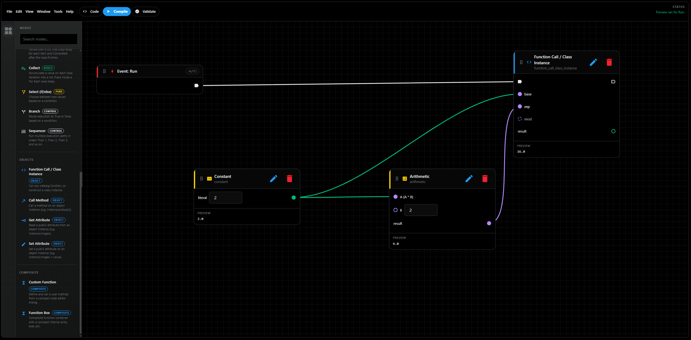

# Standalone Usage

The standalone entry point packages Acherion as a full-screen NiceGUI app using
the generic `StandaloneAcherionHost`.



## Launching the app

From an installed package:

```bash
acherion
```

Equivalent module invocation:

```bash
python -m acherion
```

Programmatic launch:

```python
from acherion.app import main

main(host='127.0.0.1', port=8081, reload=False)
```

If you want to customize the standalone colors, call the standalone theme helper
before building your own page shell:

```python
from acherion.standalone_theme import apply_standalone_theme

apply_standalone_theme({
    'surface': '#101418',
    'text': '#f5f7fa',
    'primary': '#4ecdc4',
})
```

## What the standalone host does

`StandaloneAcherionHost` provides the default host behavior for the packaged
app.

It is responsible for:

- exposing the default external `run` event
- compiling the current graph into standalone Python source
- validating generated code by importing it into a clean namespace
- materializing generic system source nodes for external events
- driving preview execution through `run_standalone_acherion_preview`

## Default workflow

In the packaged workbench, the default flow is:

1. edit the graph visually
2. let the host normalize graph/system-node state
3. compile the normalized graph into Python source
4. refresh the generated-code pane
5. execute preview code for the selected/default event

The standalone app uses the same reusable `AcherionWorkbench` component that is
available to embedded hosts.

## Persisting graphs

Graph persistence is handled through the designer API rather than a standalone-
specific storage abstraction.

Persist a graph with:

```python
graph_dict = workbench.designer.to_dict()
```

Restore it with:

```python
workbench.designer.set_graph_from_dict(graph_dict)
```

The serialized structure is JSON-safe and is designed for storing in files,
databases, or any other host-managed persistence layer.

## Working with generated code

The standalone host compiles the graph into Python source. You can get that code
through either the designer or the workbench:

```python
source_code = workbench.generated_user_code()
```

If you already have an `AcherionGraph`, you can compile it directly without the
UI:

```python
from acherion import compile_acherion_graph

source_code = compile_acherion_graph(graph)
```

Execute generated code with optional scoped bindings:

```python
from acherion import execute_acherion_graph

result = execute_acherion_graph(
    source_code,
    bindings={'inputs': {'value': 42}},
)
```

## Preview bindings

The designer keeps preview inputs separate from persisted graph state.

- `designer.preview_bindings()` returns the current transient bindings
- `designer.set_preview_binding_value(scope, key, value)` updates one binding
- `designer.clear_preview_binding_value(scope, key)` removes one binding
- `designer.preview_reference_values()` returns the most recent preview results

This separation makes it easier to experiment with runtime values without
modifying the saved graph.